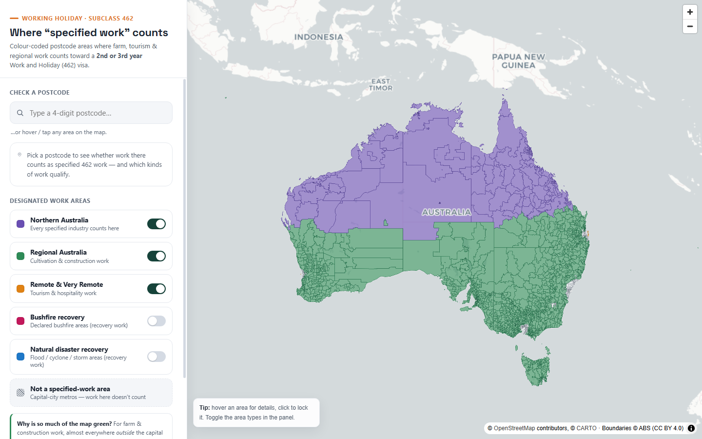

# Australia 462 "Specified Work" Map

An interactive map of the Australian postcode areas where **specified work** counts toward a
**second or third Working Holiday (subclass 462) visa**, colour-coded by designated area and the
kinds of work each one unlocks.

> **Important:** A 462 visa already lets you work almost anywhere in Australia for 12 months
> (max 6 months per employer). These colours only matter for **extending** to a 2nd/3rd year by
> doing eligible specified work. This tool is an informational aid, **not legal advice** — always
> confirm against the official page before relying on it.



## What it shows

Each postcode is an ABS **Postal Area (POA) 2021** polygon, coloured by the most permissive
designated area it falls in:

| Colour | Area | Work that counts there |
|--------|------|------------------------|
| 🟣 Purple | **Northern Australia** | Every specified industry — tourism & hospitality, plant & animal cultivation, fishing & pearling, tree farming & felling, construction |
| 🟢 Green | **Regional Australia** | Plant & animal cultivation, construction (the classic "farm work") |
| 🟠 Orange | **Remote & Very Remote** | Tourism & hospitality |
| 🩷 Pink (toggle) | **Bushfire declared areas** | Bushfire recovery work (declared periods) |
| 🔵 Blue (toggle) | **Natural disaster declared areas** | Flood / cyclone / severe-weather recovery |
| ⚪ Grey | Not a specified-work area | (e.g. capital-city metros) |

Because *Remote* and *Northern* postcodes are almost always **also** in the *Regional* list,
the default view is mostly green/purple; toggle layers off to isolate a single area. Hover or tap
any area — or search a postcode — to see its full eligibility and the qualifying job types.

Bushfire & natural-disaster recovery areas are **off by default**: they're declaration-based,
change over time, and overlap the major cities (recovery work is a special case).

## Tech (why this stack)

Fully **static** site — no backend, no API key, no build tooling required to run.

- **MapLibre GL JS** (BSD-3, no key) renders ~2,644 WebGL polygons smoothly. *(Google Maps was
  ruled out: Google does not provide Australian postal-code boundaries for data-driven styling,
  and the only Google path needs a billable key.)*
- **CARTO Positron** basemap + labels (no key) over OpenStreetMap data.
- Boundaries: **ABS ASGS Edition 3 Postal Areas 2021** (GDA2020), simplified to ~330 m and
  4-decimal precision → an **8 MB GeoJSON (≈2 MB gzipped)** loaded as one source.
- Data is pre-baked offline; the browser never touches the raw ~34 MB source.

## Run locally

```bash
# from the project root
python -m http.server 8000
# open http://localhost:8000
```
(Any static file server works — it's just `index.html` + `data/`.)

## Deploy (free)

It's two folders of static files. Pick one:

**Cloudflare Pages / Netlify (drag-and-drop)** — drop the project folder in; done. Both serve the
GeoJSON with gzip and a free custom domain.

**GitHub Pages**
```bash
git init && git add . && git commit -m "462 work map"
# create a repo, push, then enable Pages on the default branch (root)
```
Plain GeoJSON is fetched whole (no range requests), so GitHub Pages is fine here.

## Rebuild the data

The committed `data/` files are generated. To regenerate (e.g. when immi updates the lists or ABS
ships a new POA edition):

```bash
pip install shapely
python build/process.py     # re-downloads the CSV + ABS POA if missing; immi HTML is bundled
```

Outputs: `data/eligible_poa.geojson` (tagged polygons), `data/postcodes.json` (search lookup),
`data/meta.json` (per-area counts + provenance). Tune `SIMPLIFY_TOL` / `COORD_DECIMALS` at the top
of `build/process.py` to trade size for fidelity.

## Sources & attribution

- **Eligibility rules / postcodes:** [immi.homeaffairs.gov.au — Specified work (subclass 462)](https://immi.homeaffairs.gov.au/visas/getting-a-visa/visa-listing/work-holiday-462/specified-462-work). Legal basis: *LIN 18/197* (F2018L01539).
- **Boundaries:** Australian Bureau of Statistics, *Postal Areas 2021* — © ABS, **CC BY 4.0**. POAs are statistical approximations of postcodes and don't perfectly match Australia Post boundaries; a few PO-box-only postcodes have no area.
- **Basemap:** © OpenStreetMap contributors, © CARTO.
- **Postcode index/centroids:** [matthewproctor/australianpostcodes](https://github.com/matthewproctor/australianpostcodes).

_Not affiliated with the Department of Home Affairs. Verify any decision against the official site._
